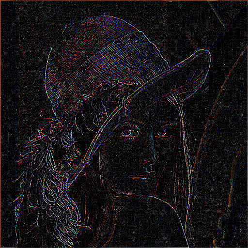

# Cuda-Image-Manipulation

A project that takes bitmap images and applies different filters to them

## Edge Detection

|             Original Image              |               Sobel Edge Detection                |
| :-------------------------------------: | :-----------------------------------------------: |
|  |  |

|            Original Image            |                 Laplacian Edge Detection                  |
| :----------------------------------: | :-------------------------------------------------------: |
|  |  |

## Project Setup

Install Cuda 11 here:
https://developer.nvidia.com/cuda-downloads

## Authors

- Tyler Gamlem
- Jeremy Knight
- Mason Caird  
  We designed and completed this project together to satisfy Whitworth University's CS 315 (Distributed Scalable Computing) Final Project
